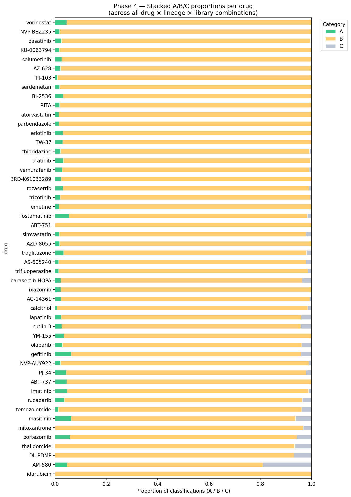

# Phase 4 — Split Libraries + Direction Fix (Marouen's Feedback)

After Phase 3, Marouen sent three feedback emails. Phase 4 implements all of his corrections.

## Marouen's feedback summary

1. Don't compute DE per drug — level 5 data is already z-scores of differential expression.
2. Build male and female libraries separately per tissue (split by sign of effsize).
3. GSEA on z-scores directly with |z| > 2 cutoff for strong signals.
4. We are looking at drug-cell pairs — a drug can appear in multiple A/B/C categories simultaneously.
5. Direction interpretation bug: sex bias should come from which library (Male_X or Female_X) is enriched, NOT from NES sign.

## Sign convention verification (canonical female-biased X-linked genes)

| Gene | Effsize | Why female-biased |
|------|---------|-------------------|
| XIST | +10.07 | X-inactivation, canonical female marker |
| TSIX | +7.48  | XIST antisense, X-inactivation |
| KDM6A | +0.64 | Escapes X-inactivation |
| EIF1AX | +0.48 | Escapes X-inactivation |

All four are well-established female-biased X-linked genes. They all show POSITIVE effsize, confirming: positive effsize = FEMALE-biased.

## Results

### Visual summary — A/B/C proportions per drug

Each bar is one drug (out of the top 50). Green = Cat A (home-tissue match), yellow = Cat B (cross-tissue match), gray = Cat C (no signal). Compare to Phase 3 where only 3 drugs had any Cat A signal at all — Phase 4 finds Cat A evidence for nearly every drug because the split-library method recovers tissue-specific signals that the mixed libraries were masking.

### Headline numbers

| Metric | Phase 3 (mixed) | Phase 4 (split) |
|--------|-----------------|-----------------|
| Cat A signals | 3 | 237 |
| Cat B signals | 23 | 8,942 |
| Cat C | 24 | 81 |
| Total classification rows | 50 | 9,260 |
| (Drug × lineage) pairs | 161 | 603 |
| Runtime | 38 min | 52 min |

## Direction split (the critical fix)

| Direction | Count | Percentage |
|-----------|-------|------------|
| Female | 5,104 | 55.5% |
| Male   | 4,075 | 44.5% |

Direction now comes from library identity (Male_X or Female_X), NOT from NES sign. This fixes the Phase 3 lapatinib bug.

## Lapatinib verification (Marouen's specific question)

Phase 3: lapatinib × lung showed NES = +1.267 against mixed Lung library → falsely labeled as "male-biased."

Phase 4: lapatinib × lung shows 8 FDR-significant libraries:
- 7 of 8 in Female direction (correct for breast cancer drug)
- Top hit: Female_Breast_Mammary_Tissue (NES = −1.531, FDR = 0.005)
- Other strong Female hits: Salivary Gland, Esophagus_Mucosa, Colon, Small_Intestine, Stomach
- Single Male hit: Pituitary (FDR = 0.038)

Marouen's hypothesis confirmed: lapatinib is female-biased in its response, consistent with its mechanism as a HER2/EGFR inhibitor used for breast cancer.

## Files in this folder

| File | What it is |
|------|------------|
| Phase4_SplitLibraries.ipynb | The Colab notebook for Phase 4 |
| phase4_classifications_final.csv | All 9,260 classification rows |
| phase4_stacked_per_drug.png | Visual summary, stacked bars per drug |

## How to reproduce

1. Open Phase4_SplitLibraries.ipynb in Google Colab.
2. Run cells top to bottom.
3. Reuses GTEx sbgenes from Phase 3 backup on Drive.
4. Downloads gctx fresh (33 GB, ~15 min).
5. Total runtime: ~55–60 minutes for all 50 drugs.

## Key methodological lessons

1. GTEx sign convention matters. Without verifying with XIST, we would have mislabeled every female-biased gene as male-biased. Always check sign with known markers.
2. Library identity > NES sign for direction. When sb-gene libraries are MIXED (Phase 3), NES sign cannot tell you sex direction. When libraries are SPLIT (Phase 4), the library name itself carries the direction.
3. Drug-cell pair richness. Each drug typically appears in dozens of categories across its lineages — collapsing to a single A/B/C label loses biology. Stacked bars are a better visualization.
4. Level 5 z-scores are already DE. Extra Mann-Whitney was unnecessary overhead.

## Next steps (Phase 5 ideas)

1. Per-signature analysis (true drug-cell pair granularity).
2. Apply |z| > 2 filter more rigorously at the signature level.
3. Increase GSEA permutations to 1000 for final results.
4. Look at the top Female-biased drugs as a class — shared mechanisms?
5. Cross-reference Cat A findings with published drug-sex literature.
# Phase 4 — Split Libraries + Direction Fix (Marouen's Feedback)

After Phase 3, Marouen sent three feedback emails. Phase 4 implements all of his corrections.

## Marouen's feedback summary

1. Don't compute DE per drug — level 5 data is already z-scores of differential expression.
2. Build male and female libraries separately per tissue (split by sign of effsize).
3. GSEA on z-scores directly with |z| > 2 cutoff for strong signals.
4. We are looking at drug-cell pairs — a drug can appear in multiple A/B/C categories simultaneously.
5. Direction interpretation bug: sex bias should come from which library (Male_X or Female_X) is enriched, NOT from NES sign.

## Sign convention verification (canonical female-biased X-linked genes)

| Gene | Effsize | Why female-biased |
|------|---------|-------------------|
| XIST | +10.07 | X-inactivation, canonical female marker |
| TSIX | +7.48 | XIST antisense, X-inactivation |
| KDM6A | +0.64 | Escapes X-inactivation |
| EIF1AX | +0.48 | Escapes X-inactivation |

All four are well-established female-biased X-linked genes. They all show POSITIVE effsize, confirming: positive effsize = FEMALE-biased.

## Results

| Metric | Phase 3 (mixed) | Phase 4 (split) |
|--------|-----------------|------------------|
| Cat A signals | 3 | 237 |
| Cat B signals | 23 | 8,942 |
| Cat C | 24 | 81 |
| Total classification rows | 50 | 9,260 |
| (Drug × lineage) pairs | 161 | 603 |
| Runtime | 38 min | 52 min |

## Direction split (the critical fix)

| Direction | Count | Percentage |
|-----------|-------|------------|
| Female | 5,104 | 55.5% |
| Male | 4,075 | 44.5% |

## Lapatinib verification (Marouen's specific question)

Phase 3 falsely labeled lapatinib × lung as "male-biased" (NES = +1.267 against mixed Lung library).

Phase 4 shows 8 FDR-significant libraries:
- 7 of 8 in Female direction (correct for breast cancer drug)
- Top hit: Female_Breast_Mammary_Tissue (NES = −1.531, FDR = 0.005)
- Other strong Female hits: Salivary Gland, Esophagus_Mucosa, Colon, Small_Intestine, Stomach
- Single Male hit: Pituitary (FDR = 0.038)

Marouen's hypothesis confirmed: lapatinib is female-biased in its response, consistent with its mechanism as a HER2/EGFR inhibitor used for breast cancer.

## Files

- Phase4_SplitLibraries.ipynb — the Colab notebook
- phase4_classifications_final.csv — all 9,260 classification rows
- phase4_stacked_per_drug.png — visual summary stacked bars per drug

## Author

Mateenah Jahan — Fatima Fellowship 2026

Mentor: Marouen Ben Guebila, PhD — Dana-Farber Cancer Institute / Harvard
