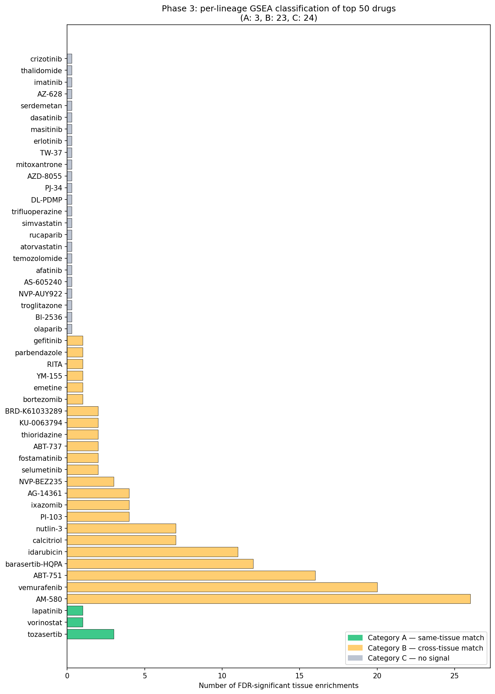

# Project 59 — CMAP × GTEx Sex-Biased Drug Response

> Three-phase computational pipeline that screens 50 drugs for tissue-specific
> sex differences in gene expression. Uses public CMAP/LINCS 2020 and GTEx v8 data.

[](https://www.python.org/)
[](https://colab.research.google.com/)
[](LICENSE)
[](https://www.fatimafellowship.com/)

---

##  The question

Drug studies usually report a single average effect. But male and female cells
often respond differently. This project asks:

> **Does a drug's sex-specific effect on gene expression match the tissue's
> natural sex biology?**

We screen 50 most-tested drugs from CMAP against 44 GTEx tissues and classify
each drug into one of three categories:

| Label | Meaning |
|-------|---------|
| **A** | Drug modulates sex-biased genes in its OWN tissue → real signal |
| **B** | Drug modulates sex-biased genes in a DIFFERENT tissue → off-target |
| **C** | No significant tissue-specific sex effect |

---

## 📁 Three phases, three folders

The project progressed in three stages. Each phase has its own folder with
the notebook, the results, the figures, and a step-by-step README.

### 📂 [Phase1_Vorinostat/](Phase1_Vorinostat/)

**Single-drug pilot.** Built and tested the male-vs-female differential
expression pipeline on one drug (vorinostat, an HDAC inhibitor).

- Found **20 sex-biased genes** (7 male-biased, 13 female-biased)
- Validated the method by recovering **CDKN1A** (a known HDAC target)

### 📂 [Phase2_Fishers_50Drugs/](Phase2_Fishers_50Drugs/)

**Scaled to 50 drugs with Fisher's exact test.** Added the GTEx sex-biased
gene library and the A/B/C classification.

- 49 of 50 drugs → Category C (no signal)
- 1 of 50 → Category A: AS-605240 (but only 2 DE genes → **likely artifact**)
- Honest finding: pooled-across-lineages analysis dilutes tissue-specific signal

### 📂 [Phase3_PerLineage_GSEA/](Phase3_PerLineage_GSEA/)

**Proper per-lineage analysis with GSEA.** Followed Marouen's actual
recommendation — run DE separately per cell lineage and use GSEA
(`gseapy.prerank`) instead of Fisher's exact test.

- **3 clean Category A drugs** found: tozasertib, lapatinib, vorinostat
- **23 Category B drugs** as future follow-up candidates
- Phase 2's "Cat A" hit (AS-605240) correctly falls to Cat C — confirming it was an artifact
- This is the **definitive result** of the project

---

##  Headline result



| Method | Cat A | Cat B | Cat C |
|--------|-------|-------|-------|
| Phase 2 (Fisher's, pooled) | 1 (artifact) | 0 | 49 |
| **Phase 3 (GSEA, per-lineage)** | **3 clean** | **23** | 24 |

### The 3 Category A drugs (from Phase 3)

| Drug | Lineage | GTEx tissue | NES | FDR |
|------|---------|-------------|-----|-----|
| **Tozasertib** | haematopoietic | Spleen | −1.475 | 0.001 |
| **Tozasertib** | haematopoietic | Whole_Blood | −1.342 | 0.007 |
| **Tozasertib** | haematopoietic | EBV lymphocytes | −1.193 | 0.016 |
| **Lapatinib** | lung | Lung | +1.267 | 0.032 |
| **Vorinostat** | large_intestine | Colon_Transverse | −1.189 | 0.029 |

---

## 🚀 Quick start

```bash
# Clone the repo
git clone https://github.com/MateenahJAHAN/Project-59-CMAP-Sex-Differences.git
cd Project-59-CMAP-Sex-Differences

# Install dependencies
pip install -r requirements.txt
```

Then open any phase folder and run the notebook in Google Colab:

| Folder | Notebook | Runtime |
|--------|----------|---------|
| `Phase1_Vorinostat/` | `Project59_CMAP_SexDifferences.ipynb` | ~20 min |
| `Phase2_Fishers_50Drugs/` | `Project59_GTEx_DrugClassification.ipynb` | ~30 min |
| `Phase3_PerLineage_GSEA/` | `Phase3_PerLineage_GSEA.ipynb` | ~40 min |

For step-by-step explanations and results of each phase, open the
**README.md inside that phase's folder**.

---

##  Data sources

### CMAP / LINCS 2020 (clue.io)

- `cellinfo_beta.txt` — cell line metadata (donor sex, lineage)
- `siginfo_beta.txt` — drug experiment metadata
- `geneinfo_beta.txt` — gene ID translator (Entrez ↔ Ensembl)
- `level5_beta_trt_cp_n720216x12328.gctx` — z-score matrix, 720,216 signatures × 12,328 genes (33 GB)

### GTEx v8 (gtexportal.org)

- `GTEx_Analysis_v8_sbgenes.tar.gz` — sex-biased genes per tissue
  (44 tissues × 13,294 genes, LFSR ≤ 0.05)

All inputs are public and free.

---

## 🔬 Why Phase 3 outperformed Phase 2

Two design changes drove the improvement:

| | Phase 2 | Phase 3 |
|---|---------|---------|
| DE strategy | Pooled all lineages | Per-lineage separately |
| Enrichment test | Fisher's exact (binary) | GSEA (full ranked list) |
| Result | Tissue signal diluted; only 1 fake Cat A | 3 clean Cat A + 23 Cat B |

For full method detail, open each phase's README.

---

##  Next steps (Phase 4 ideas)

1. Validate tozasertib's blood signal on isolated cell lines (K562, MOLM13)
2. Investigate top Cat B drugs (AM-580, vemurafenib) for off-target sex effects
3. Use GSEA leading-edge analysis to identify driver genes per Cat A hit
4. Cross-reference findings with published sex-biased drug literature

---

##  Citation

```
Jahan, M. (2026). Per-lineage GSEA classification of sex-biased drug response
in CMAP/LINCS 2020 against GTEx v8 sex-biased genes. Fatima Fellowship 2026,
Project 59. Mentor: Dr. Marouen Ben Guebila (Dana-Farber).
GitHub: https://github.com/MateenahJAHAN/Project-59-CMAP-Sex-Differences
```

---

##  Author

**Mateenah Jahan** — Fatima Fellowship 2026

Mentor: [**Marouen Ben Guebila, PhD**](https://labs.dana-farber.org/viswanathanlab/people/marouen-ben-guebila-phd) (Viswanathan Lab, Dana-Farber Cancer Institute)

---

## 📜 License

MIT License. See [LICENSE](LICENSE).
